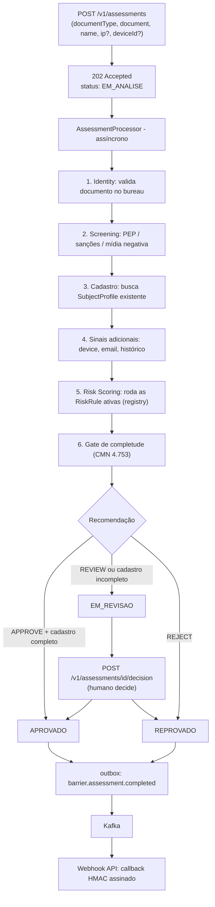

# Fluxo completo de KYC — PF e PJ

Este documento descreve o fluxo ponta a ponta de uma avaliação de KYC/PLD-FT no Barrier,
para pessoa física (PF/CPF) e pessoa jurídica (PJ/CNPJ), do intake até a decisão final e a
entrega ao cliente. É o complemento operacional de [overview.md](overview.md) (arquitetura),
[domain-contexts.md](domain-contexts.md) (módulos) e [event-flow.md](event-flow.md) (eventos).

> **Nota de status:** as fases 0–7 (identidade, screening, motor de risco, cadastro CMN
> 4.753, config por tenant, registry de regras, mídia negativa, consistência
> telefone×endereço) estão em `main`. As demais regras da Fase 8 (GeoIP, reuso de device/
> email, VoIP, email descartável, histórico interno, score de crédito externo) estão em
> branches empilhadas (`#5`, `#6`, `#7`) ainda não mergeadas — marcadas como **(em revisão)**
> nas tabelas abaixo. Ver [risk-engine-plan.md](../implementation/risk-engine-plan.md).

## 1. Visão geral do fluxo



O fluxo é **o mesmo pipeline para PF e PJ** — não há branch de código separado por tipo de
documento no orquestrador (`AssessmentProcessor`). A diferença entre PF e PJ está em:

1. **Qual bureau responde** (CPF vs. CNPJ) e quais dados objetivos ele traz.
2. **Quais campos de cadastro são exigidos** (`RegistrationCompleteness` por `documentType`).
3. **Quais `RiskRule` se aplicam** — algumas só têm sentido para PJ (empresa recém-aberta,
   CNAE, quadro societário); a maioria é comum aos dois tipos.

## 2. Intake

`POST /v1/assessments` (header `X-Client-Id` obrigatório — tenant):

```json
{
  "documentType": "CPF",
  "document": "111.444.777-35",
  "name": "Fulano de Tal",
  "ip": "200.1.2.3",
  "deviceId": "device-abc123"
}
```

- `documentType`: `CPF` ou `CNPJ` — único ponto de bifurcação explícita no contrato.
- `document`: validado (dígito verificador) antes de aceitar; inválido → `400`.
- `ip`/`deviceId`: opcionais, alimentam os sinais de rede (GeoIP, reuso de device) — **(em
  revisão, PR #5)**.
- Resposta: **`202 { id, status: EM_ANALISE }`** — processamento é assíncrono
  (`AssessmentProcessor`, `@Scheduled`).
- Por trás do intake: `Subject` (identidade mínima do cliente final) é achado-ou-criado por
  documento — **compartilhado entre tenants** (dedup global), mas só visível para quem tem
  vínculo (`tenant_subjects`) — ver [ADR-0011](../adr/0011-subject-compartilhado-acesso-por-associacao.md).

## 3. Identidade (Identity)

Cadeia de bureaus com fallback (`@Order`) — bureau indisponível cai para o próximo; resultado
definitivo encerra a cadeia:

| Tipo | Provider (ordem) | Observação |
|------|-------------------|------------|
| **CNPJ** | `BrasilApiBureauProvider` (`@Order(10)`) | Real. Devolve situação cadastral + `CompanyProfile` (data de abertura, CNAE, QSA) |
| **CPF**  | `BigBoostBureauProvider` (`@Order(20)`, desligado por padrão) → `FakeCpfBureauProvider` (`@Order(100)`, fora de `prod`) | BigBoost é real (dataset `basic_data`), self-service — [ADR-0014](../adr/0014-bureau-cpf-bigboost.md). O simulado atende dev/teste com cenários escolhidos por prefixo — [bureau-simulado.md](../implementation/bureau-simulado.md) |

O simulado **não é autoritativo**: quando há bureau real habilitado para o tipo, `IdentityService`
o remove da cadeia. Bureau real indisponível vira `UNAVAILABLE` → revisão, nunca "verificado".

Resultado: `IdentityCheck` com status `VERIFIED`/`NOT_FOUND`/`MISMATCH`/`DECEASED`/`UNAVAILABLE`. Para
PJ, o `CompanyProfile` (quando presente) é **persistido no `SubjectProfile`** (data de
abertura, CNAE, QSA) — antes era descartado depois de alimentar as regras, hoje vira cadastro.

## 4. Screening (listas restritivas + mídia negativa)

Match contra listas ingeridas (`watchlist_entries`, `ADR-0010`) — exato por documento
(`LocalWatchlistProvider`) e fuzzy por nome (`FuzzyNameWatchlistProvider`, Jaro-Winkler):

| Fonte | Tipo de apontamento | Real/stub |
|-------|---------------------|-----------|
| CGU (CEIS/CNEP) | Sanção administrativa | Real (gated, off por padrão em dev) |
| OFAC (SDN/alt) | Sanção internacional | Real (gated, off por padrão em dev) |
| Seed CSV | PEP/sanção (dev) | Stub |
| `StubNegativeMediaProvider` | Mídia negativa | Stub — casa nome contra lista configurável, vazia por padrão |

Resultado: `ScreeningResult` com uma lista de `ScreeningHit` (tipo PEP/SANCTION/ADVERSE_MEDIA).
Aplica-se **igualmente a PF e PJ** — o nome da pessoa física ou da empresa/representante é o
que casa contra as listas.

## 5. Cadastro (CMN 4.753) — aqui PF e PJ divergem

`SubjectProfile` é o cadastro completo, 1:1 com `Subject`, **progressivo**
(`PUT /v1/subjects/{document}/profile`, merge parcial — campo omitido preserva o valor
existente). O checklist mínimo (`RegistrationCompleteness.evaluate`) é **por tipo de
documento**:

| Campo | PF (CPF) | PJ (CNPJ) |
|-------|:--------:|:---------:|
| `birthDate` (data de nascimento) | ✅ obrigatório | — |
| `nationality` (nacionalidade) | ✅ obrigatório | — |
| `occupation` (ocupação) | ✅ obrigatório | — |
| `foundingDate` (data de fundação) | — | ✅ obrigatório |
| `cnaeCode` (CNAE) | — | ✅ obrigatório |
| `legalRepresentativeName`/`Document` (representante legal) | — | ✅ obrigatório |
| `address` (endereço) | ✅ obrigatório | ✅ obrigatório |
| `phone`, `email` | opcional (mas alimenta regras de risco) | opcional (idem) |
| `declaredIncome` | renda mensal declarada | faturamento anual declarado |
| `shareCapital`, `partners` (QSA) | — | opcional (QSA vem do bureau automaticamente) |

Se o cadastro estiver incompleto para o tipo de documento, o `AssessmentProcessor` **rebaixa
`APROVADO` → `EM_REVISAO`** (mesmo que o score de risco desse aprovação), com um fator
explicando os campos faltantes — reaproveita o workflow humano de decisão, sem status novo.

## 6. Sinais adicionais **(em revisão, PRs #5–#7)**

Calculados pelo `AssessmentProcessor` antes de montar o `RiskContext` — aplicam-se a **PF e
PJ igualmente** (nenhum é específico de tipo de documento):

- **Reuso de device** (`DeviceSeenService`): quantos subjects distintos usaram o mesmo
  `deviceId` numa janela (default 30 dias).
- **Reuso de email** (`SubjectProfileService.countOtherSubjectsWithEmail`): quantos outros
  subjects já usaram o mesmo email cadastrado.
- **Histórico interno** (`SubjectHistoryService`): eventos registrados via
  `POST /v1/subjects/{document}/history` (chargeback, PIX devolvido, denúncia, conta
  encerrada por fraude) — sem pipeline automático de transação ainda (Fase 8, item 7).

## 7. Motor de risco — todas as regras (`RiskRule`, Strategy)

O motor (`RiskScoringService`) roda todas as regras **ativas no registry**
(`risk_rule_registry` — liga/desliga sem deploy), soma o score de cada uma (0–1000, com
override de recomendação), e deriva a banda:

**Bandas:** ≤199 `LOW` · ≤499 `MEDIUM` · ≤799 `HIGH` · >799 `CRITICAL` (fixas, não
configuráveis por tenant nem desligáveis no registry).

| Regra (`code`) | O que verifica | PF | PJ | Score/efeito | Configurável por tenant? | Status |
|---|---|:--:|:--:|---|:--:|---|
| `IDENTITY` | Resultado do bureau (NOT_FOUND→bloqueio, MISMATCH→revisão, UNAVAILABLE→pontua) | ✅ | ✅ | 150–900 + override | ❌ fixa (regulatória) | ✅ main |
| `SANCTION` | Apontamento em lista de sanções | ✅ | ✅ | 1000 + REJECT | ❌ fixa | ✅ main |
| `PEP` | Pessoa Exposta Politicamente | ✅ | ✅ | 300 + REVIEW | ❌ fixa | ✅ main |
| `NEGATIVE_MEDIA` | Apontamento em mídia negativa | ✅ | ✅ | 250 + REVIEW | ❌ fixa | ✅ main |
| `NEW_COMPANY` | Empresa aberta há menos de N meses | — | ✅ | 150 (default) | ✅ `months`/`score` | ✅ main |
| `SENSITIVE_CNAE` | CNAE em atividade sensível a PLD-FT | — | ✅ | 200 (default) | ✅ `score`/`cnae-codes` (união) | ✅ main |
| `CORPORATE_STRUCTURE` | Sócio estrangeiro/PJ no QSA (KYB 1º grau) | — | ✅ | até 300 | ❌ | ✅ main |
| `PHONE_ADDRESS_MISMATCH` | DDD do telefone ≠ UF do endereço | ✅ | ✅ | 60 (default) | ❌ | ✅ main |
| `GEO_MISMATCH` | UF do IP ≠ UF do endereço | ✅ | ✅ | 80 (default) | ❌ | ⏳ PR #5 |
| `DEVICE_REUSE` | Mesmo device em ≥N subjects recentes | ✅ | ✅ | 120 (default, N=3) | ❌ | ⏳ PR #5 |
| `PHONE_VOIP` | Telefone é VoIP | ✅ | ✅ | 50 (default) | ❌ | ⏳ PR #6 |
| `EMAIL_DISPOSABLE` | Email de domínio descartável | ✅ | ✅ | 90 (default) | ❌ | ⏳ PR #6 |
| `EMAIL_REUSE` | Mesmo email em ≥N subjects distintos | ✅ | ✅ | 100 (default, N=2) | ❌ | ⏳ PR #6 |
| `HISTORY` | Chargeback/PIX devolvido/denúncia/conta encerrada por fraude | ✅ | ✅ | 60–400 por evento | ❌ | ⏳ PR #7 |
| `CREDIT_SCORE_LOW` | Score de crédito externo abaixo do limiar | ✅ | ✅ | 70 (default) | ❌ | ⏳ PR #7 (inerte — sem provider real ainda) |

**Legenda "Configurável por tenant?":** overrides ficam em `tenant_risk_config`
(`PUT /v1/tenants/{tenantId}/risk-config`) e só valem pra regras de **apetite de risco**,
nunca pras regulatórias fixas (identidade, sanção, PEP, mídia negativa, bandas) — travado por
uma regra ArchUnit dedicada.

**Legenda "Status":** ✅ = mergeado em `main`; ⏳ = em branch aberta, ainda não mergeada.

## 8. Decisão

```
score total (0–1000) → banda (LOW/MEDIUM/HIGH/CRITICAL)
                     ↓
recomendação = mais severa entre (banda → APPROVE/REVIEW/REJECT) e overrides das regras
                     ↓
status = APROVADO / EM_REVISAO / REPROVADO
                     ↓
se status == APROVADO e cadastro incompleto → rebaixa pra EM_REVISAO
```

Toda decisão vem com **fatores explicáveis** (`factors`, no `GET /v1/assessments/{id}`):
cada regra que disparou aparece com `ruleCode`, score, severidade, motivo e evidências —
exigência regulatória de explicabilidade (Circular BCB 3.978), não é opcional.

## 9. Revisão manual (EDD)

Avaliação em `EM_REVISAO` (por regra de risco ou cadastro incompleto) é decidida por humano:

```
POST /v1/assessments/{id}/decision
{ "decision": "APPROVE" | "REJECT", "reviewedBy": "analista@empresa", "reason": "..." }
```

Só vale a partir de `EM_REVISAO` (senão `409`); grava a trilha (`reviewedBy`/`reason`/
`reviewedAt`) e **reemite** `barrier.assessment.completed` com o desfecho final — mesmo
contrato de evento, disparado pela decisão humana em vez do processador automático.

## 10. Entrega ao cliente

`barrier.assessment.completed` (outbox → Kafka) → **Webhook API** consome, monta o corpo,
assina com HMAC, faz `POST` no endpoint do cliente, registra em `deliveries` (idempotência
por `eventId`, retry com backoff). O cliente também pode consultar `GET /v1/assessments/{id}`
a qualquer momento — o fluxo não depende do webhook para ter o resultado.

## 11. Resumo — o que muda entre PF e PJ

| Aspecto | PF | PJ |
|---|---|---|
| Documento | CPF | CNPJ |
| Bureau | BigBoost (real) → stub | BrasilAPI (real) |
| Dado objetivo do bureau | — | `CompanyProfile` (abertura, CNAE, QSA) |
| Cadastro mínimo (CMN 4.753) | nascimento, nacionalidade, ocupação, endereço | fundação, CNAE, endereço, representante legal |
| Regras exclusivas | nenhuma | `NEW_COMPANY`, `SENSITIVE_CNAE`, `CORPORATE_STRUCTURE` |
| Regras comuns | identidade, sanção, PEP, mídia negativa, consistência, GeoIP, device, telefone, email, histórico, score externo | idem |
| Orquestração | mesmo `AssessmentProcessor`, sem branch de código | idem |

## Referências

- [overview.md](overview.md) — arquitetura e módulos.
- [domain-contexts.md](domain-contexts.md) — bounded contexts.
- [event-flow.md](event-flow.md) — contrato de evento e sequência.
- [compliance.md](compliance.md) — normas e papéis LGPD.
- [ADR-0011](../adr/0011-subject-compartilhado-acesso-por-associacao.md) — subject compartilhado.
- [ADR-0012](../adr/0012-subject-registration-profile.md) — cadastro CMN 4.753.
- [ADR-0014](../adr/0014-bureau-cpf-bigboost.md) — bureau real de CPF.
- [risk-engine-plan.md](../implementation/risk-engine-plan.md) — fases e fila de PRs.
