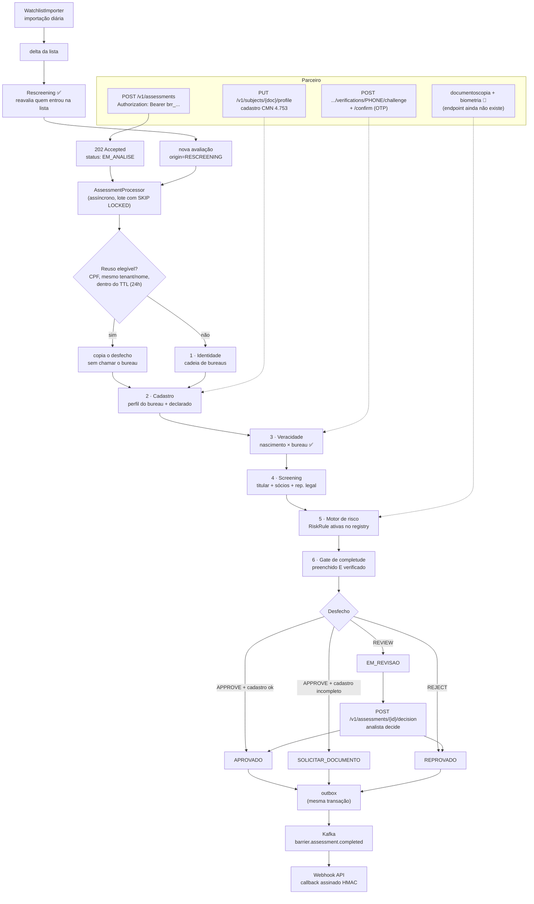

# Fluxo completo de KYC — PF e PJ, etapa a etapa, com payloads

Fluxo ponta a ponta de uma avaliação de KYC/PLD-FT no Barrier, do intake à entrega do desfecho ao
parceiro. Complementa [overview.md](overview.md) (arquitetura), [domain-contexts.md](domain-contexts.md)
(módulos) e [event-flow.md](event-flow.md) (eventos).

> **Como ler este documento.** Cada etapa marca o que está em `main` e o que não está. Etapa
> marcada 🔌 tem o código escrito mas **não está ligada no fluxo**: nada a chama hoje. Etapa
> marcada 📋 é decisão registrada em ADR sem implementação. Misturar as três seria vender como
> pronto o que não roda — que é exatamente o erro que este projeto vem corrigindo nos controles.

| Marca | Significado |
|-------|-------------|
| ✅ | Implementado, ligado no fluxo e coberto por teste |
| 🔌 | Implementado e testado, **mas nenhum caminho de produção o executa** |
| 📋 | Decidido em ADR, sem código |

---

## 1. Visão geral



**O pipeline é o mesmo para PF e PJ** — não há branch por tipo de documento no orquestrador. O que
muda é qual bureau responde, quais campos o cadastro exige e quais regras se aplicam.

---

## 2. Autenticação (todas as chamadas) ✅

```http
Authorization: Bearer brr_<keyId>_<secret>
```

O tenant sai da chave, não de header autodeclarado. O `X-Client-Id` antigo era autodeclaração:
qualquer chamador dizia ser qualquer parceiro. Endpoints administrativos (registry de regras,
config por tenant, endpoints de webhook) usam `X-Admin-Key` separado — credencial de tenant não
abre endpoint administrativo, e vice-versa.

---

## 3. Intake ✅

`POST /v1/assessments`

```json
{
  "documentType": "CPF",
  "document": "111.444.777-35",
  "name": "Fulano de Tal"
}
```

Header opcional `Idempotency-Key: <string>` — mesma chave + mesmo conteúdo dentro de 24h devolve a
avaliação original com `Idempotency-Replayed: true`; mesma chave + conteúdo diferente responde 409.
Sem ele, cada POST cria avaliação nova.

**202 Accepted:**

```json
{
  "id": "f1c90f2c-9ea7-4ce7-b314-7bd1f14e55fd",
  "status": "EM_ANALISE",
  "riskLevel": null,
  "decision": null,
  "factors": [],
  "createdAt": "2026-08-12T13:07:26.832Z",
  "completedAt": null,
  "reviewedBy": null,
  "reviewedByKey": null,
  "reviewReason": null,
  "reviewedAt": null
}
```

O que acontece no servidor: acha-ou-cria o `Subject` por documento (dedup global), garante o
vínculo `tenant_subjects`, grava a avaliação em `EM_ANALISE`. O processamento é assíncrono.

---

## 4. Cadastro CMN 4.753 ✅

`PUT /v1/subjects/{documento}/profile` — progressivo, aceita patch parcial a qualquer momento.
Campo nulo preserva o que já estava.

```json
{
  "birthDate": "1990-01-01",
  "nationality": "Brasileira",
  "occupation": "Engenheira",
  "declaredIncome": 12000.00,
  "address": {
    "street": "Rua A", "number": "10", "complement": null,
    "district": "Centro", "city": "São Paulo", "state": "SP", "zipCode": "01000-000"
  },
  "phone": "11999998888",
  "email": "fulana@exemplo.com"
}
```

**200 OK** — devolve completude, **nunca o cadastro** (patch vazio era um vetor de leitura do
dossiê alheio, fechado na V024):

```json
{
  "complete": false,
  "missingFields": [
    "data de nascimento não conferida com o bureau",
    "telefone ou e-mail verificado"
  ]
}
```

O cadastro pertence ao par `(subject, tenant)`: um parceiro não lê nem altera o que outro declarou.

Para PJ, os campos são `foundingDate`, `cnaeCode`, `cnaeDescription`, `shareCapital`,
`legalRepresentativeName`, `legalRepresentativeDocument` e `partners[]`.

---

## 5. Verificação de veracidade ✅

O gate distingue **preenchido** de **verificado**: cadastro preenchido com dado plausível e
inventado satisfazia o checklist e liberava aprovação automática.

**5.1 — Emitir o desafio.** O destino sai do cadastro, nunca do corpo:

`POST /v1/subjects/{documento}/verifications/PHONE/challenge` → **202**

```json
{ "challengeId": "0f2a7b0e-2b1a-4a1e-9f3a-9c0d5b6a1e77" }
```

O código vai por SMS/e-mail e **não volta na resposta**, nem em dev — é essa separação que o torna
prova de posse.

**5.2 — Confirmar:**

`POST /v1/subjects/{documento}/verifications/PHONE/confirm`

```json
{ "code": "418302" }
```

**204** quando confirma; **422** para código errado, expirado ou sem tentativas — os três
respondem igual de propósito, para não dizer ao atacante onde insistir.

**5.3 — Nascimento** é verificado sozinho, no processamento: se o que o parceiro declarou bate com
o que o bureau devolveu, vira verificação `BUREAU`. Divergência não vira exceção nem reprovação.

Regras que valem para todos os campos: código guardado só em hash, teto de tentativas, expiração,
uso único, e **verificação amarrada ao valor** — trocar o telefone derruba o selo junto.

Campos verificáveis: `PHONE`, `EMAIL`, `BIRTH_DATE`, `ADDRESS` (este último ainda sem provider).

---

## 6. Documentoscopia e biometria 🔌

Código escrito, testado e **não ligado**: nenhum endpoint existe e o `AssessmentProcessor` não
preenche o `AssuranceSummary`, então hoje a regra de risco sempre devolve "não aplicável".

O que existe: contrato (`DocumentVerificationProvider`, `BiometricVerificationProvider`), stubs que
escolhem desfecho pela referência de captura, persistência do resultado (V035), guard que barra
provedor simulado em produção, e a `IdentityAssuranceRiskRule`.

**Decisão central ([ADR-0016](../adr/0016-plataforma-completa-modelo-b.md)): guarda o resultado,
nunca a imagem.** Sem foto, selfie ou template biométrico — base biométrica vazada não se revoga.
O registro é:

```json
{
  "kind": "DOCUMENT",
  "outcome": "PASS",
  "score": 97,
  "provider": "documentoscopia-simulada",
  "providerReference": "stub:cap-9f2a",
  "algorithmVersion": "stub/1.0.0",
  "submittedHash": "9f86d081884c7d659a2feaa0c55ad015a3bf4f1b2b0b822cd15d6c15b0f00a08",
  "detail": "documentoscopia simulada (RG)",
  "checkedAt": "2026-08-12T13:10:00Z"
}
```

Falta para ligar: adapter de provedor real, endpoints de submissão, extração de campos do documento
(o cruzamento documento × cadastro não existe) e o preenchimento do `AssuranceSummary` no
processador.

---

## 7. Processamento assíncrono ✅

`AssessmentProcessor` reivindica um lote com `FOR UPDATE SKIP LOCKED` (réplicas pegam conjuntos
disjuntos), processa cada avaliação **fora de transação** (bureau e screening são HTTP lento) e
persiste cada desfecho na própria transação, junto com o evento.

### 7.1 Identidade

Cadeia de bureaus por prioridade com fallback: bureau indisponível cai para o próximo; resultado
definitivo encerra. CNPJ via BrasilAPI e BigBoost; CPF via BigBoost (simulado fora de `prod`).
Disjuntor por provider evita insistir em bureau fora do ar.

Desfechos: `MATCH`, `MISMATCH`, `NOT_FOUND`, `DECEASED`, `UNAVAILABLE`. Situação cadastral decide
antes da comparação de nome — CPF suspenso/cancelado nunca vira `MATCH`.

Rastro gravado em `identity_checks`: `provider_reference` (QueryId do provedor) e `raw_response`
JSONB **com redação** do nome da mãe.

**Reuso de verificação (desligado por padrão, `barrier.identity.reuse.enabled`).** Antes de sair
para a rede, `IdentityService` consulta se já existe um check elegível — mesmo tenant, mesmo CPF,
mesmo nome normalizado, desfecho definitivo (nunca `UNAVAILABLE`), dentro do TTL (`PT24H`). Se
houver, grava um check novo apontando para o original em `reused_from_id` e pula a chamada ao
bureau — a avaliação continua tendo o próprio `identity_check`, só a evidência é copiada. Só CPF:
CNPJ nunca reaproveita, porque o `CompanyProfile` (QSA/CNAE) do bureau é transiente e não fica no
check — reusar um check de PJ devolveria QSA vazio e faria a `CorporateStructureRiskRule` parar de
disparar em silêncio. A procedência (`identityReused`/`identityCheckedAt`, este último seguindo
`reused_from_id` até a consulta que de fato foi à rede) aparece no `GET` e no evento — ver §8 e
§10 — e os contadores `barrier.identity.check{outcome="fresh"|"reused"}` separam economia de
custo de queda de tráfego.

### 7.2 Screening

Consulta `watchlist_entries` (listas ingeridas, ADR-0010) por documento exato e por nome (fuzzy,
Jaro-Winkler token a token, simétrico). Fontes: OFAC, CSNU/ONU, CEIS, CNEP, PEP da CGU.

Cobre **titular + sócios do QSA + representante legal**, cada apontamento carregando a parte a que
pertence. Só o titular bloqueia: apontamento de sócio escala para revisão, nunca reprova a PJ.

O snapshot das versões consultadas vai para `sources_json` — é o que torna um `CLEAR` verificável
meses depois.

### 7.3 Motor de risco

Cada `RiskRule` ativa no registry avalia e devolve score, severidade, motivo, evidências e
recomendação. `RiskScoringService` soma 0–1000 em bandas LOW/MEDIUM/HIGH/CRITICAL.

Fica gravado em `risk_scores`: `results_json` (as que dispararam), `evaluated_json` (**todas**, com
`TRIGGERED`/`NOT_TRIGGERED`/`SUPPRESSED` e os **parâmetros efetivos** de cada uma) e a
`ENGINE_VERSION`. Provar que um controle *rodou e passou* é o núcleo da auditabilidade.

### 7.4 Gate de completude

Depois do score. Risco aprovado + cadastro incompleto **não** vira reprovação nem revisão: vira
`SOLICITAR_DOCUMENTO`. Reprovar por falta de dado mentiria na trilha e contaminaria a taxa de
recusa que o regulador lê como indicador de PLD-FT.

---

## 8. Desfechos ✅

| Status | Quando | Sai dele como |
|--------|--------|---------------|
| `EM_ANALISE` | intake | automático |
| `APROVADO` | APPROVE + cadastro completo e verificado | terminal |
| `SOLICITAR_DOCUMENTO` | APPROVE + cadastro incompleto/não verificado | completar cadastro e submeter nova avaliação |
| `EM_REVISAO` | REVIEW (PEP, sanção por nome, mídia negativa…) | decisão humana |
| `REPROVADO` | REJECT (sanção por documento no titular, CPF falecido…) | terminal |
| `FALHA_PROCESSAMENTO` | 5 tentativas esgotadas | reprocessamento manual |

**GET** `/v1/assessments/{id}` (escopado por tenant):

```json
{
  "id": "f1c90f2c-9ea7-4ce7-b314-7bd1f14e55fd",
  "status": "EM_REVISAO",
  "riskLevel": "HIGH",
  "decision": "Revisão manual recomendada",
  "factors": [
    "SANCTION_NAME_MATCH: match por nome 100% — OFAC SDN (TITULAR)",
    "Cadastro incompleto: telefone ou e-mail verificado"
  ],
  "createdAt": "2026-08-12T13:07:26.832Z",
  "completedAt": "2026-08-12T13:07:27.617Z",
  "reviewedBy": null,
  "reviewedByKey": null,
  "reviewReason": null,
  "reviewedAt": null,
  "identityReused": false,
  "identityCheckedAt": "2026-08-12T13:07:27.100Z"
}
```

`identityReused`/`identityCheckedAt` vêm nulos quando ainda não existe check para a avaliação
(processamento em andamento). Quando `identityReused: true`, `identityCheckedAt` **não** é o
instante desta avaliação — é o da consulta original, seguindo `reused_from_id` (ver §7.1).

---

## 9. Revisão manual (EDD) ✅

`POST /v1/assessments/{id}/decision` — só a partir de `EM_REVISAO` (senão 409):

```json
{
  "decision": "APPROVE",
  "reviewedBy": "ana.silva@parceiro.com",
  "reason": "Homônimo confirmado: data de nascimento e nacionalidade divergem da entrada OFAC"
}
```

Grava a trilha (`reviewed_by`, `review_reason`, `reviewed_at`, e a API key que decidiu) e **reemite
o evento**, para o parceiro receber o desfecho final pelo mesmo canal.

> 📋 4-eyes (dois revisores distintos para PEP/mídia negativa) e os status `BLOQUEIO_TEMPORARIO` /
> `ESCALADO_AML` seguem abertos — ver o [backlog de produto](../product/backlog.md).

---

## 10. Entrega ao parceiro ✅

O evento é gravado na **outbox, na mesma transação** da mudança de estado; um relay publica no
Kafka. Envelope:

```json
{
  "eventId": "6c1f...",
  "type": "barrier.assessment.completed",
  "assessmentId": "f1c90f2c-9ea7-4ce7-b314-7bd1f14e55fd",
  "occurredAt": "2026-08-12T13:07:27.617Z",
  "version": 1,
  "correlationId": "ec18b5d4-d466-4c8c-a1f3-0291330eba50",
  "payload": {
    "assessmentId": "f1c90f2c-9ea7-4ce7-b314-7bd1f14e55fd",
    "tenantId": "acme",
    "status": "APROVADO",
    "riskLevel": "LOW",
    "decision": "Aprovado automaticamente",
    "completedAt": "2026-08-12T13:07:27.617Z",
    "identityReused": false,
    "identityCheckedAt": "2026-08-12T13:07:27.100Z"
  }
}
```

`identityReused`/`identityCheckedAt` existem no evento pelo mesmo motivo que no `GET` (§8): o
parceiro recebe o desfecho pelo webhook, não busca o `GET` — se a decisão se apoia numa
verificação de ontem, ele precisa saber disso na própria trilha. Campo novo em JSON é
retrocompatível; a Webhook API não desserializa o payload em tipo estrito (repassa como string
opaca), então o acréscimo não exigiu mudança nela.

A Webhook API consome, resolve o endpoint **do tenant do evento** e entrega assinado:

```http
POST https://parceiro.exemplo.com/webhooks/barrier
X-Barrier-Event-Id: 6c1f...
X-Barrier-Signature: t=1700000000,v1=<hex>
X-Barrier-Signature-Previous: t=1700000000,v1=<hex>   (só durante janela de rotação de segredo)
```

A assinatura cobre `<t>.<corpo cru>`, não só o corpo: o instante viaja **dentro** do que é
assinado, senão o atacante trocaria o carimbo do que capturou por "agora" e o replay voltaria a
passar. O receptor recusa o que estiver fora da tolerância (5 min é o padrão; ver
`tools/webhook-receiver.py`). O `t` é o da **tentativa**, não o da criação da entrega — congelá-lo
faria toda retentativa posterior à janela chegar velha e ser recusada. As duas assinaturas da
janela de rotação declaram o mesmo `t`.

Idempotência por `eventId`, retry com backoff, DLT para payload ilegível e um job de reconciliação
que relê o tópico e cria entrega para toda decisão sem uma.

---

## 11. Monitoramento contínuo (rescreening) ✅

Fora do fluxo de onboarding: a cada importação de lista, o **delta** dispara reavaliação de quem
passou a constar nela — por documento e por nome. A reavaliação é uma avaliação nova pelo mesmo
pipeline, com `origin=RESCREENING` e `origin_detail=fonte@versão`, então o parceiro recebe o
desfecho pelo webhook de sempre.

Travas: importação sobre base vazia é linha de base e não dispara; teto por importação aborta e
grita; uma avaliação por `(subject, tenant)` por importação.

---

## 12. O que muda entre PF e PJ

| Etapa | PF (CPF) | PJ (CNPJ) |
|-------|----------|-----------|
| Bureau | BigBoost (`basic_data` pessoas) | BrasilAPI + BigBoost (empresas) |
| Cadastro mínimo | nascimento, nacionalidade, ocupação, endereço | fundação, CNAE, endereço, representante legal |
| Verificação | nascimento × bureau + canal (OTP) | canal (OTP) |
| Screening | titular | titular + sócios do QSA + representante legal |
| Regras exclusivas | — | empresa nova, CNAE sensível, estrutura societária |
| Aberto | — | UBO ≥25% além do 1º grau 📋 |

---

## Referências

- [ADR-0016](../adr/0016-plataforma-completa-modelo-b.md) — plataforma completa: resultado, não acervo
- [ADR-0012](../adr/0012-subject-registration-profile.md) — cadastro como agregado próprio
- [ADR-0010](../adr/0010-watchlists-ingeridas.md) — watchlists ingeridas
- [backlog de produto](../product/backlog.md) — o que falta para produção, com critério de pronto
- [event-flow.md](event-flow.md) · [domain-contexts.md](domain-contexts.md) · [compliance.md](compliance.md)
