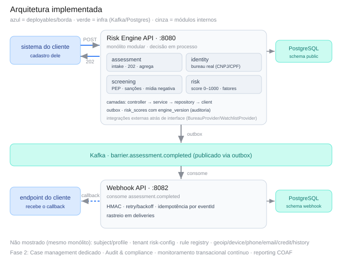
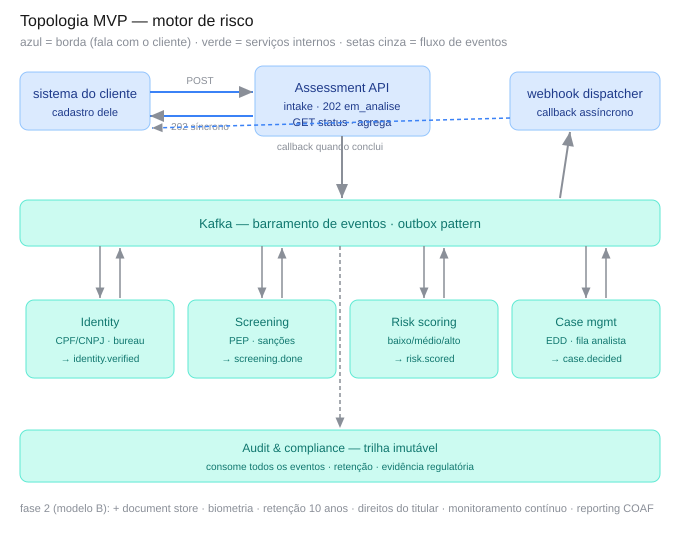
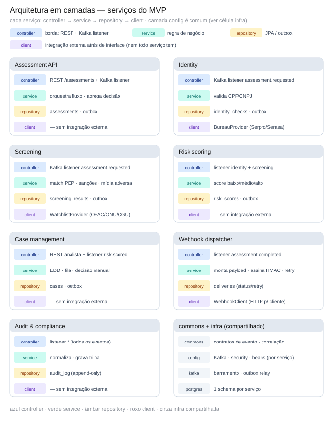

# Visão geral da arquitetura

## Princípios

1. **Borda não bloqueia.** A API responde na hora (`202 em_analise`) e joga o trabalho
   pesado (bureaus, OCR, watchlists) para processamento assíncrono via Kafka.
2. **Coreografia, não orquestração central.** Cada serviço reage a eventos e emite os
   seus. Não há um orquestrador único que conhece o fluxo inteiro.
3. **Auditoria é cidadã de primeira classe.** Todo evento é imutável e retido. A trilha
   de auditoria é requisito regulatório, não feature opcional.
4. **Camadas clássicas por serviço.** Cada microserviço usa `controller → service →
   repository`. Integrações externas ficam atrás de uma interface no pacote `client`.
5. **Fase 1 ⊂ Fase 2.** O motor de risco de hoje é subconjunto da plataforma completa
   de amanhã; a evolução adiciona módulos, não reescreve.

## Estado implementado

Dois deployables no monorepo — ver [ADR-0009](../adr/0009-risk-engine-modular-monolith-first.md):

1. **Risk Engine API** (`services/risk-engine`, `:8080`): um único deployable que encapsula
   **assessment, identity, screening, risk, subject/profile (cadastro CMN 4.753), tenant
   (config de risco por parceiro) e device/geoip/phone/email/credit/history** (sinais de
   risco adicionais) como módulos internos em camadas clássicas, conversando por chamada de
   método em processo. Publica `barrier.assessment.completed` no Kafka via outbox.
2. **Webhook API** (`services/webhook-api`, `:8082`): consome `assessment.completed` e entrega
   o resultado no endpoint do cliente, com HMAC, retry/backoff e idempotência.

Cada serviço é dono do seu schema no PostgreSQL (`public` para a Risk Engine, `webhook` para
a Webhook API).



### Fluxo de uma avaliação

`POST /v1/assessments` → **202** `{id, EM_ANALISE}` → processamento assíncrono
(**identity → screening → risk**) → o motor consolida um **score 0–1000**, nível
(LOW/MEDIUM/HIGH/CRITICAL) e recomendação, que vira o status (APROVADO/EM_REVISAO/REPROVADO)
→ evento na outbox → **Webhook API** faz o callback assinado. O cliente também pode consultar
`GET /v1/assessments/{id}`. Detalhes do contrato de evento em [event-flow.md](event-flow.md);
passo a passo completo (PF e PJ, todas as regras) em [kyc-flow.md](kyc-flow.md).

## Topologia-alvo (visão de longo prazo — microserviços)

A visão abaixo é o **destino**, não o corte inicial. O núcleo de risco será dividido
incrementalmente quando a escala exigir.



```
sistema do cliente ──POST──▶ Assessment API ──202 síncrono──▶ sistema do cliente
                                   │
                                   ▼ (outbox)
                          ┌──────────────────┐
                          │  Kafka (eventos) │
                          └──────────────────┘
             ┌──────────┬──────────┼──────────┬─────────────┐
             ▼          ▼          ▼           ▼             ▼
         Identity   Screening   Risk       Case mgmt    Webhook
                                scoring                  dispatcher
                                   │
                          ┌──────────────────┐
                          │ Audit & compliance│  (consome todos os eventos)
                          └──────────────────┘
```

Ver diagrama detalhado em [event-flow.md](event-flow.md) e o SVG em
[docs/diagrams/topologia-mvp.svg](../diagrams/topologia-mvp.svg).

## Serviços da topologia-alvo

Papéis na visão de longo prazo. No corte atual, os três primeiros são **módulos internos**
da Risk Engine API; os demais entram nas fases seguintes.

| Serviço / módulo     | Papel                                                            | Estado                     |
|----------------------|------------------------------------------------------------------|----------------------------|
| **Assessment**       | Borda. Intake, resposta 202, consulta de status, agregação final | ✅ módulo da Risk Engine    |
| **Identity**         | Validação CPF/CNPJ, cruzamento com bureaus (BrasilAPI/BigBoost reais + stub) | ✅ módulo da Risk Engine |
| **Screening**        | Match PEP, sanções (ONU/OFAC/CGU real) e mídia negativa (stub)   | ✅ módulo da Risk Engine    |
| **Subject / Profile** | Identidade mínima do cliente (dedup) + cadastro CMN 4.753 progressivo | ✅ módulo da Risk Engine |
| **Risk scoring**     | Motor de regras (Strategy): score 0–1000, nível e recomendação; registry liga/desliga regra sem deploy | ✅ módulo da Risk Engine |
| **Tenant / Config**  | Resolução de tenant + overrides de parâmetro de risco por parceiro | ✅ módulo da Risk Engine |
| **Webhook API**      | Callback assíncrono ao cliente com HMAC, retry e idempotência   | ✅ deployable próprio       |
| **Case management**  | Revisão manual (EDD) via `POST /decision`; fila de analistas dedicada segue fase 2 | 🟡 parcial |
| **Audit & compliance** | Trilha imutável, retenção, evidência regulatória              | ⏳ fase 2                   |

## Estilo interno de cada serviço (camadas clássicas)

```
com.barrier.<serviço>.<contexto>
├── controller     REST (@RestController) + listeners Kafka (@KafkaListener)
├── service        regra de negócio (+ Strategy: RiskRule, ScreeningRule)
├── repository     JPA (@Repository) atrás de interface de domínio
├── domain         entidades/records e enums (no módulo risk: domain/enums, domain/model)
├── client         integrações externas atrás de interface (BureauProvider, WatchlistProvider)
└── config         Kafka, security, beans
```

> Nota de arquitetura: um serviço orquestrador pode chamar outro serviço de domínio
> (`AssessmentProcessor → IdentityService/ScreeningService/RiskScoringService`) — orquestração
> legítima num monólito modular. O ArchUnit valida as camadas e garante ausência de ciclos
> entre módulos.

Disciplina única obrigatória: o `service` acessa integrações externas **por interface**
(pacote `client`), nunca pelo SDK direto. Custo baixo, ganho alto para teste e auditoria.

Referência do padrão de camadas na visão-alvo de longo prazo (microserviços):



## Padrões transversais

- **Outbox pattern** — evento gravado na mesma transação do banco; relay publica no Kafka.
  Garante "gravou = publicou", sem *dual-write*.
- **Idempotência** — consumidores tratam entrega repetida (Kafka é *at-least-once*). A
  Webhook API desduplica por `eventId` (constraint UNIQUE em `deliveries`).
- **Correlação** — `assessmentId` viaja em todos os eventos como *correlation id*,
  alimentando auditoria e *tracing*.

## Infraestrutura de desenvolvimento

- Monorepo Maven multi-módulo (um módulo por serviço + módulo `commons` de eventos).
- `docker-compose` local sobe Kafka + PostgreSQL.

> Ver [ADR-0008](../adr/0008-monorepo-maven.md).
